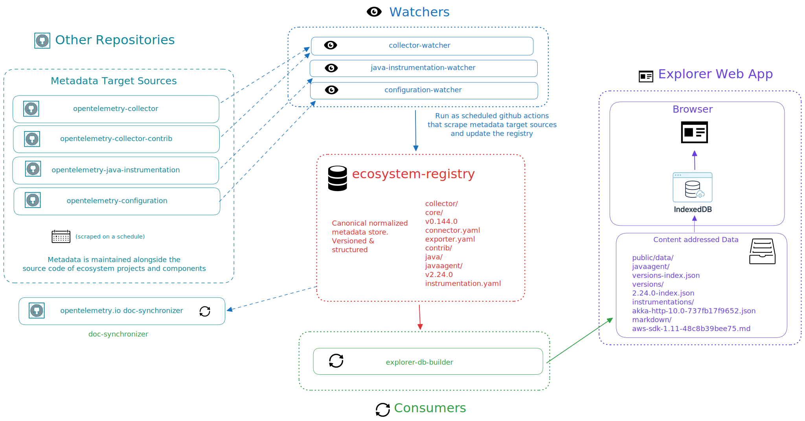

# Ecosystem Explorer Documentation

This directory contains documentation for the OpenTelemetry Ecosystem Explorer project. It includes guides, references,
and resources to help users understand and contribute to the project.

Also reference the [project wiki](https://github.com/open-telemetry/opentelemetry-ecosystem-explorer/wiki) for
additional information.

## Architecture Overview

<!-- markdownlint-disable MD033 -->

<!-- markdownlint-enable MD033 -->

* **[System Architecture](./architecture-overview.md)**: Three-component system overview
* **[Watchers and Synchronizers](./watchers-synchronizers.md)**: Automation pipeline for metadata updates
* **[Registry Structure](./registry-structure.md)**: Metadata organization and versioning
* **[Content-Addressed Storage](./content-addressed-storage.md)**: Storage pattern for multi-version support
* **[Frontend Architecture](./frontend-architecture.md)**: Web app design and caching

### Additional Resources

* [Project Wiki](https://github.com/open-telemetry/opentelemetry-ecosystem-explorer/wiki)
* [Project Proposal](https://github.com/open-telemetry/community/blob/main/projects/ecosystem-explorer.md)
* [CONTRIBUTING.md](../CONTRIBUTING.md)

## Project Guiding Principles

* Leverage automation as much as possible
* Reduce burden/overhead on maintainers as much as possible
* Keep maintenance burden and operational overhead of the web application low
  * Avoid backend servers/databases and use static hosting/CDN where possible
* Prioritize responsiveness, accessibility and localization from the start
