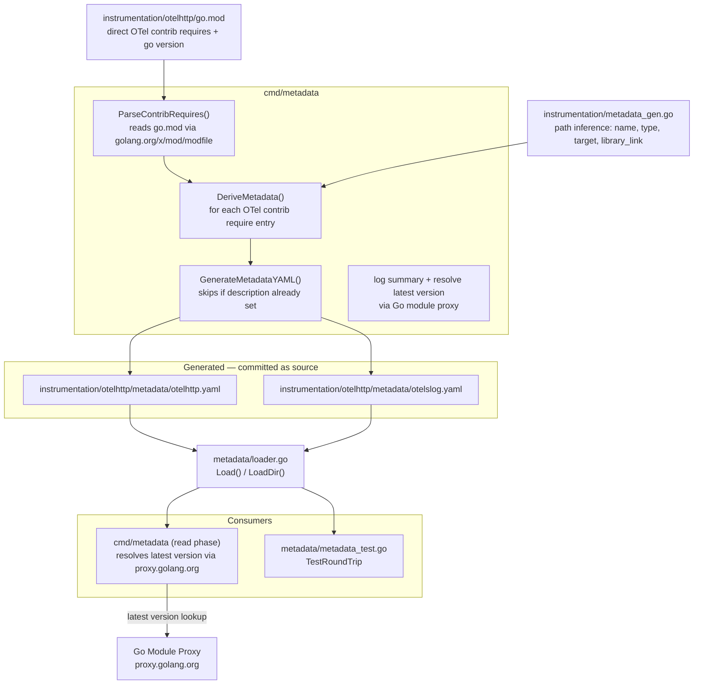

# Instrumentation

Each subdirectory is a self-contained Go module demonstrating one or more
[opentelemetry-go-contrib](https://github.com/open-telemetry/opentelemetry-go-contrib)
libraries. The `metadata/` subdirectory inside each exemplar contains generated
YAML descriptor files — one per OTel contrib library declared in the exemplar's
`go.mod`.

## Generating metadata YAML files

```sh
make metadata-gen
```

`cmd/metadata` walks each `instrumentation/*/go.mod`, finds direct
`go.opentelemetry.io/contrib/` dependencies, and derives all fields that can be
determined from the module path and version. Prose fields (`description`,
`installation.description`) are left empty for manual completion. Re-running is
safe — existing files with a non-empty `description` are not overwritten.



## How fields are derived

| Metadata field | Derived from |
| --- | --- |
| `name` | Last path segment of the module path |
| `display_name` | `displayNameMap` in `parser.go`, keyed on name minus `otel` prefix |
| `module.path` | The `require` entry path |
| `module.version` | The `require` entry version |
| `go_min_version` | `go` directive in the exemplar's `go.mod` |
| `scope.name` | Same as `module.path` |
| `library_link` | `https://pkg.go.dev/` + `module.path` |
| `source_path` | Module path suffix after `go.opentelemetry.io/contrib/` |
| `instrumentation_type` | Path prefix: `instrumentation/`→`wrapper`, `bridges/`→`bridge`, `exporters/`→`exporter`, `propagators/`→`propagator` |
| `installation.type` | `wrapper` type → `wrapper`; all others → `import` |
| `target_module` | Stripped from path (e.g. `instrumentation/net/http/otelhttp`→`net/http`); bridge targets use a static lookup table |
| `stability` | Defaults to `experimental`; update manually after checking upstream |

Fields left as stubs: `description`, `installation.description`, `installation.example`, `semantic_conventions`, `configurations`.

## Adding a new exemplar

1. Create `instrumentation/<name>/` with a `go.mod` declaring the OTel contrib libraries.
2. Run `make metadata-gen` — YAML stubs are created automatically.
3. Fill in the `description` and `installation.description` stub fields.
4. Run `make test` to validate the round-trip.
