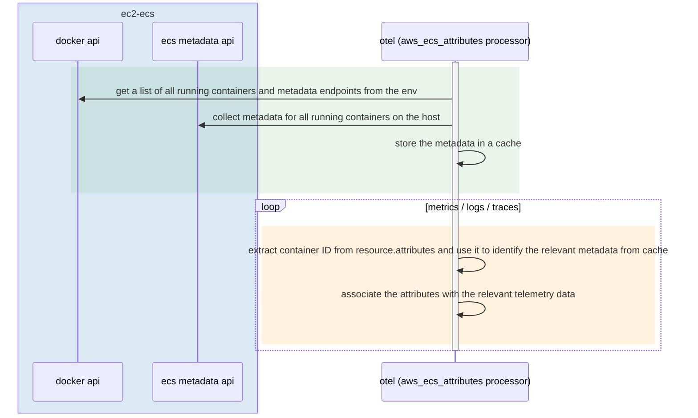

> [!NOTE]
> This is the initial skeleton donation of the component. The processors are
> currently no-op passthroughs; the ECS metadata enrichment logic is added in a
> follow-up pull request. See issue
> [#44476](https://github.com/open-telemetry/opentelemetry-collector-contrib/issues/44476).

The processor discovers the ECS metadata endpoint for each container, reads the
metadata, and attaches the relevant attributes to the corresponding telemetry.
This complements the
`resourcedetection` processor, which is designed for a single collector enriching
its own telemetry rather than centrally enriching telemetry from many containers.

## How it works

When a new container is created in ECS on EC2, the ECS Agent assigns it a metadata
endpoint that is exposed to the container through the `ECS_CONTAINER_METADATA_URI_V4`
or `ECS_CONTAINER_METADATA_URI` environment variables. The processor uses the Docker
API to list the running containers and read those endpoints, calls each endpoint to
collect the container and task metadata, and caches the result keyed by container ID.
As telemetry is received, it reads the container ID from the configured resource
attribute(s) and associates the cached metadata with the corresponding telemetry.



## Pre-requisites

- Privileged mode must be enabled for the container running the collector.
- The Docker socket must be mounted into the collector container at
  `/var/run/docker.sock`.
- The processor uses the container ID to identify the correct metadata endpoint for
  each container. It looks for the container ID in the **resource** attribute(s)
  configured via `container_id.sources`. If no container ID can be determined, no
  metadata is added.

## Configuration

| Config                 | Description                                                                                                                                                  |
|------------------------|--------------------------------------------------------------------------------------------------------------------------------------------------------------|
| `attributes`           | A list of regex patterns matching the attribute keys to collect. When omitted, all available attributes are collected.                                       |
| `container_id.sources` | The **resource** attribute key(s) that contain the container ID. If multiple keys are provided, the first non-empty value is used.                            |
| `cache_ttl`            | The time to live, in seconds, for the metadata cache. Must be at least 60 seconds.                                                                           |

Example configuration:

```yaml
processors:
  aws_ecs_attributes:
    # check for the container ID in the following resource attributes
    container_id:
      sources:
        - "container.id"
        - "log.file.name"
    # collect attributes whose keys match these patterns
    attributes:
      - '^aws.ecs.*'
      - '^docker.*'
    cache_ttl: 300
```
